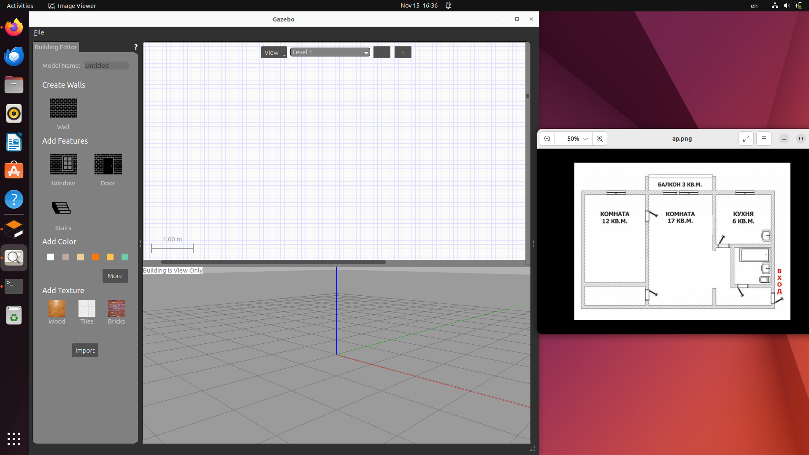
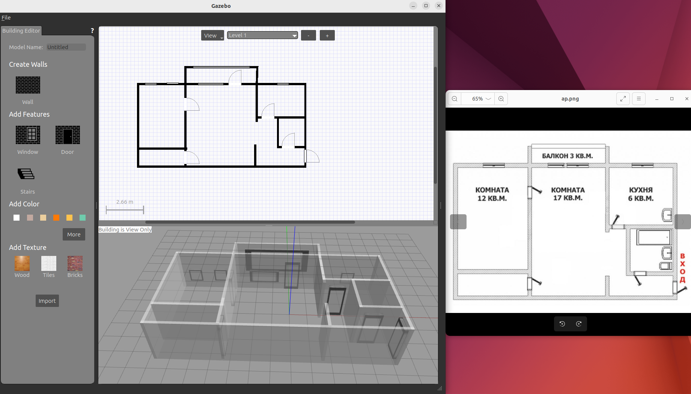
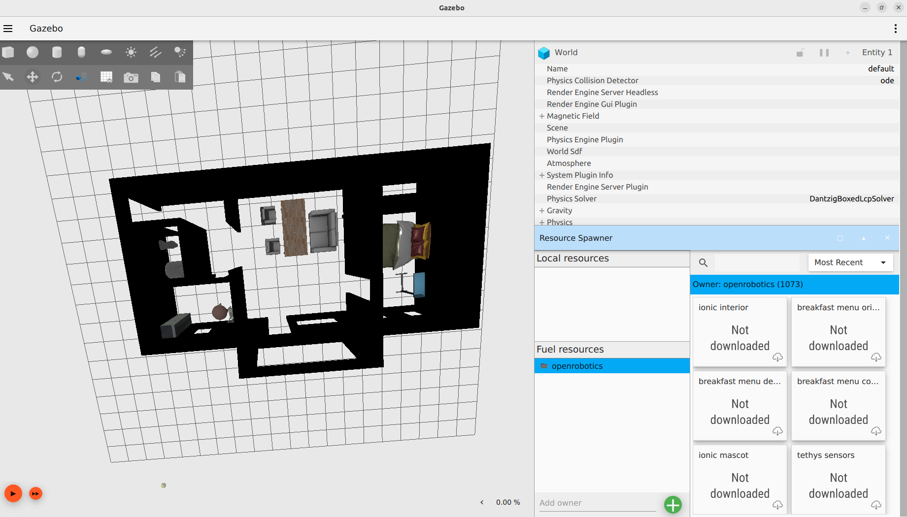
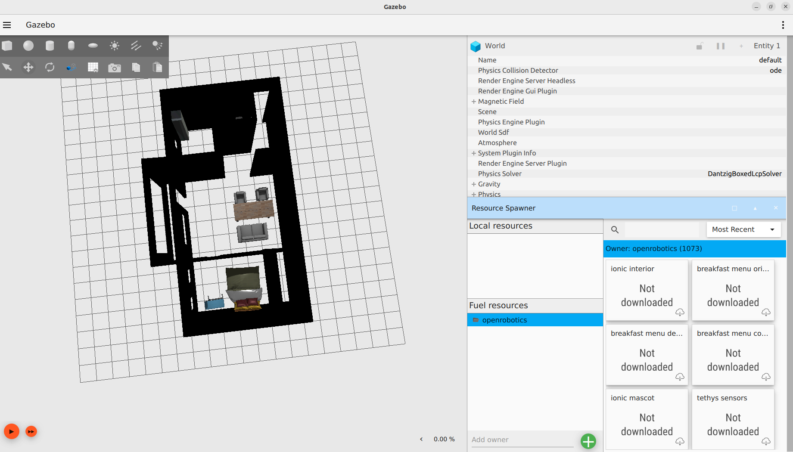
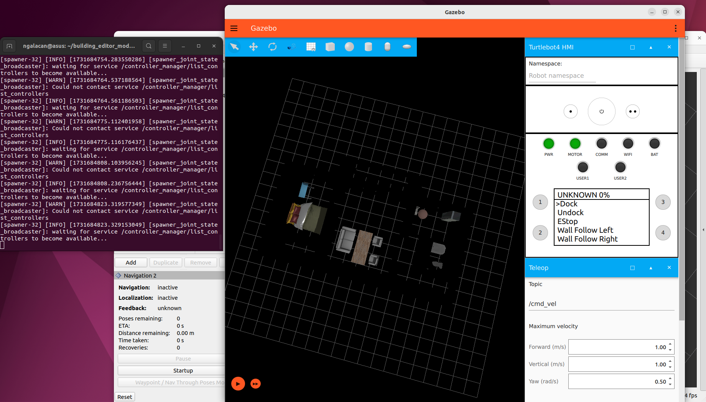

# Gazebo House ROS2. Этапы выполнения работы
## Создание плана квартиры в Gazebo Building Editor
1. Установка Gazebo Classic 11.0.0 (https://classic.gazebosim.org/download)
2. Запуск с помощью команды `gazebo`
3. Переход в меню Edit -> Building Editor



4. Черчение 2D-макета, используя инструменты Wall, Window, Door



5. Сохранение проекта в каталоге `building_editor_models/kolea_kv`

## Загрузка квартиры в Ignition Gazebo

После сохранения модели из Gazebo имеются два файла: `model.sdf` и `model.config`. 

1. Создание файла `world.sdf` в этой же папке со следующим содержанием:
```
<?xml version="1.0" ?>
<sdf version="1.6">
  <world name="default">
    <include>
      <uri>file:///home/ngalacan/building_editor_models/kolea_kv/model.sdf</uri> 
    </include>
  </world>
</sdf>

```
2. Открытие мира в Ignition Gazebo командой `ign gazebo world.sdf`
3. Установка в мире элементы интерьера, мебель, пол и источник света





4. Сохранение мира под тем же файлом

## Запуск симуляции с turtlebot 4
1. Создание рабочего пространства:
```
mkdir -p ~/turtlebot4_ws/src
cd ~/turtlebot4_ws/src
git clone https://github.com/turtlebot/turtlebot4.git
cd ~/turtlebot4_ws
colcon build --symlink-install
```
2. Запуск симуляции в ROS2
```
ros2 launch turtlebot4_ignition_bringup turtlebot4_ignition.launch.py nav2:=true slam:=false localization:=true rviz:=true
```


